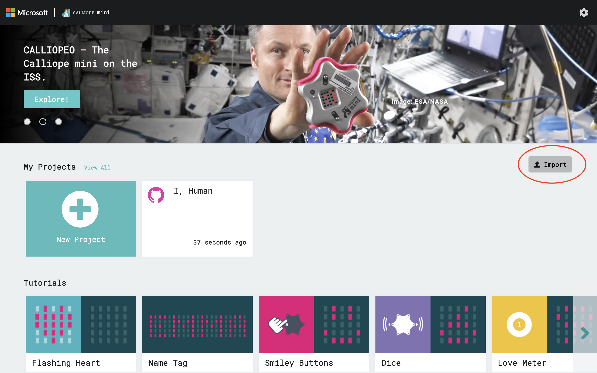
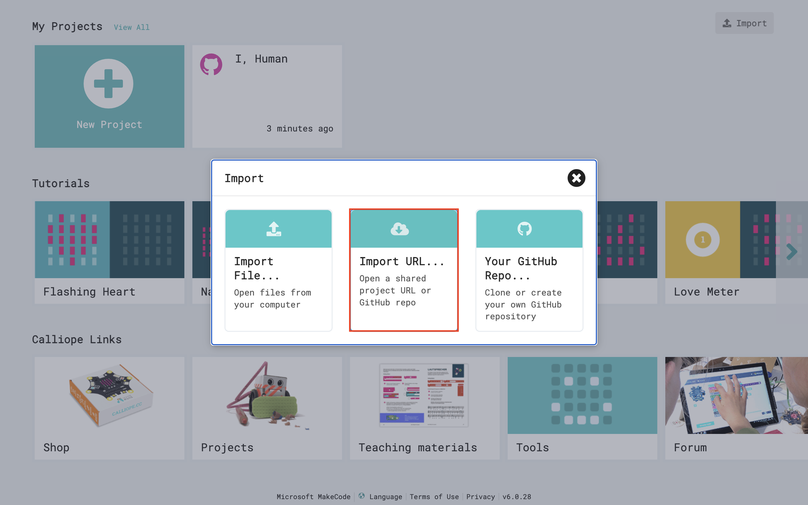
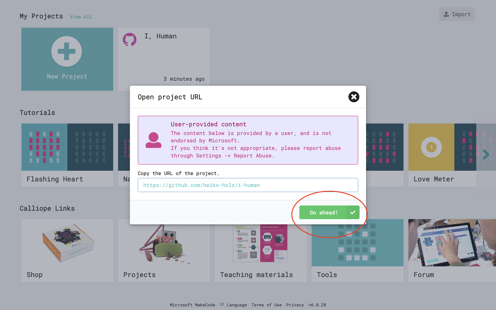

# iHuman

You can also find an interactive tutorial [here](https://ior.ad/9UIW). 

1. open <a href="https://makecode.calliope.cc/?lang=en" target="_blank">https://makecode.calliope.cc/?lang=en in a new tab (so you can follow the tutorial further)</a>
2. click on **Import** 

   
3. then click on **Import URL**

   

4. paste **https://github.com/heiko-holz/i-human** and click import or **go ahead**

   

5. maximize your calliope by clicking on the **maxmize** icon

   

6. follow the instructions of the challenge's description

   * make sure that the calliope is active, i.e., the calliope is colored and a a grey **stop** icon is shown at the very left. It should look like this:
     

   * If the calliope is greyed out and you can see a green "**play**" icon (see below), press it to activate the program.

     

     